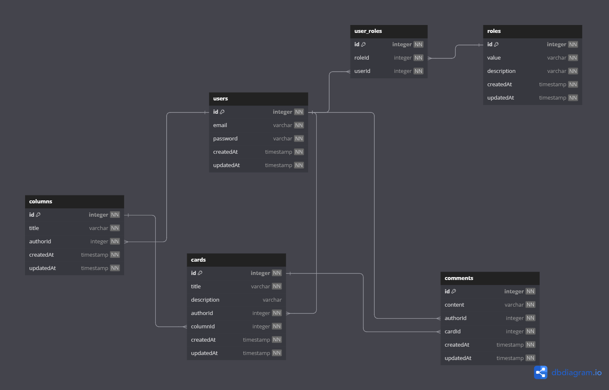

# Purrweb Test

Trello-like RESTful Api on NestJS. 

## Config

Config is located at `.env`. 

After the start it is necessary to create the role with value `‘user’` (defined in enum RolesValues). The role `‘user’` is given to each user after registration

## Docs

Documentation is located at `HOST:PORT/api/docs`.

## Project setup

```bash
$ npm install
```

## Compile and run the project

```bash
$ npm run start
```

## Docker Compose

```bash
$ docker-compose build
$ docker-compose up
```

## Usings

- jwt
- bcrypt
- Sequelize

## DB diagram

|  |
|--------------------------------------------------------------------------------------|
